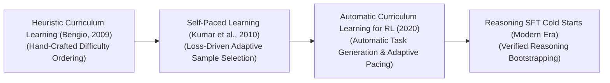

# 🚀 Awesome-Curriculum-Learning 🚀\n\n
## 🧠 Curriculum Learning in AI: The Ultimate SEO-Optimized Guide: History, Progression, Variants, & Applications

**Curriculum Learning** is a hardware-aware optimization and data-scheduling paradigm in artificial intelligence that structures the training process of machine learning models by presenting data samples in a targeted sequence of increasing difficulty. Formally conceptualized by Yoshua Bengio et al. in 2009 ("Curriculum Learning"), the framework is heavily inspired by human pedagogy: instead of forcing a student to digest advanced calculus on day one, education initiates with foundational arithmetic before systematically scaling up complexity. 

Traditional machine learning algorithms optimize parameters by shuffling datasets and ingesting samples completely at random (uniform stochastic sampling). Curriculum learning breaks this constraint by deploying an automated **Pacing Function** and a **Difficulty Measurer** to guide model exposure. By training a model on easy, low-noise samples first, the optimization graph quickly locates a clean, stable local minimum, systematically accelerating convergence speed, reducing overall training compute costs, and unlocking superior generalization boundaries across complex data landscapes.

---

## 🕒 1. The Macro Chronological Evolution

The technical framework governing data-scheduling progression has transitioned from hand-crafted heuristic filters to automated self-paced tracking, moving toward large-scale foundation reinforcement learning curricula and verifiable test-time search loops.

| Year | Method | Paper Link | Description & Link |
|---|---|---|---|
| 2009 | The Hand-Crafted Heuristic Era | [Bengio et al., 2009](https://arxiv.org) | [Details](pages/hand_crafted_heuristic.md) |
| 2010 | The Self-Paced Optimization Era | [Kumar et al., 2010](https://arxiv.org) | [Details](pages/self_paced_optimization.md) |
| 2018 | The Automatic Curriculum & Adversarial RL Era | [Sukhbaatar et al., 2018](https://arxiv.org) | [Details](pages/automatic_curriculum_rl.md) |
| 2024 | The Verifiable Reasoning SFT Cold-Start Era | [DeepSeek-R1](https://arxiv.org) | [Details](pages/verifiable_reasoning_sft.md) |

---

## ⚙️ 2. Core Operational & Scheduling Variants

Curriculum Learning architectures are strictly categorized based on how data difficulty is computed and how the pacing timeline alters the training matrix.

| Year | Variant | Paper Link | Description & Link |
|---|---|---|---|
| 2009 | Pre-Defined / Heuristic Curriculum Learning | [Bengio et al.](https://arxiv.org) | [Details](pages/pre_defined_heuristic.md) |
| 2010 | Self-Paced Learning | [Kumar et al.](https://arxiv.org) | [Details](pages/self_paced_learning.md) |
| 2019 | Anti-Curriculum Learning | [Hacohen & Weinshall](https://arxiv.org) | [Details](pages/anti_curriculum.md) |
| 2018 | Transfer-Learned / Domain-Specific | [Various](https://arxiv.org) | [Details](pages/transfer_learned.md) |

---

## 🏗️ 3. High-Capacity Architectural & Pacing Component Types

To scale up curriculum scheduling loops over massive distributed high-performance computing configurations, engineering frameworks implement specialized pacing profiles.

| Year | Component | Paper Link | Description & Link |
|---|---|---|---|
| 2009 | Pacing Functions | [N/A](#) | [Details](pages/pacing_functions.md) |
| 2020 | Dynamic Data Masking | [N/A](#) | [Details](pages/dynamic_data_masking.md) |

---

## 🚧 4. Production Engineering Challenges & Cluster Solutions

Deploying complex curriculum data schedules across massive distributed high-performance computing clusters introduces unique load-balancing and synchronization bottlenecks.

| Year | Challenge | Paper Link | Description & Link |
|---|---|---|---|
| 2021 | Distributed Dataloader Load-Imbalance | [N/A](#) | [Details](pages/distributed_dataloader.md) |
| 2020 | Learning Rate Schedule Unalignment Hazard | [N/A](#) | [Details](pages/lr_schedule_unalignment.md) |

---

## 🌍 5. Frontier Real-World AI Industrial Applications

| Year | Application | Paper Link | Description & Link |
|---|---|---|---|
| 2025 | RL Alignment for Reasoning Models | [DeepSeek-R1](https://github.com) | [Details](pages/rl_alignment_reasoning.md) |
| 2023 | Sim-to-Real Trajectory Optimization | [Various](https://arxiv.org) | [Details](pages/sim_to_real_robotics.md) |
| 1993 | Autonomous Vehicle Perception Training | [Elman, 1993](https://doi.org) | [Details](pages/autonomous_vehicle_perception.md) |

---

## References
1. Elman, J. L. (1993). Learning and development in neural networks: The importance of starting small. *Cognition*, 48(1), 71-99.
2. Bengio, Y., et al. (2009). Curriculum learning. *Proceedings of the 26th Annual International Conference on Machine Learning (ICML)*, 41-48.
3. Kumar, M. P., Packer, B., & Koller, D. (2010). Self-paced learning for latent variable models. *Advances in Neural Information Processing Systems (NeurIPS)*, 23.
4. Hacohen, G., & Weinshall, D. (2019). On the power of curriculum learning in training deep networks. *International Conference on Machine Learning (ICML)*, 2535-2544.
5. Sukhbaatar, S., et al. (2018). Not end-to-end symmetric self-play: Advanced environment curriculum generation for multi-agent reinforcement learning. *arXiv preprint arXiv:1711.09883*.
6. DeepSeek-AI. (2025). DeepSeek-R1: Incentivizing reasoning and verification capability in foundational language transformers via large-scale self-play reinforcement learning loops initialized via curriculum SFT cold-starts. *GitHub Repository Technical Infrastructure Manifesto* [INDEX: 17, 21].

---

To advance this documentation repository, automated data-scheduling blueprint, or MLOps pipeline, consider exploring these adjacent development pathways:
* Build a **Python automation script using PyTorch Dataloaders** illustrating how to write a custom dynamic pacing class that expands the sample index boundary based on running training loss averages.
* Generate a **comprehensive Markdown table** explicitly comparing Heuristic Curriculum Learning, Self-Paced Learning (SPL), Anti-Curriculum Learning, and Teacher-Student Adversarial Generation across difficulty calculation junctions, lifecycle implementation steps, operational VRAM/Token overhead costs, and risk of training saturation.
* Establish a **performance evaluation harness using Triton** to track the exact cluster-wide compute efficiency, worker synchronization times, and memory bus utilization differences achieved when routing token-balanced curriculum batches over distributed server nodes.

***

**Contextual Related Topics:**

To optimize your systemic overview of data orchestration and post-training optimization pipelines, explore these related documentation sets:
* For details on the reinforcement learned verifier loops that populate curriculum structures, check out **[Reinforcement Learning with Verifiable Rewards (RLVR)](https://github.com)**.
* To master the baseline teacher-student self-play systems that autonomously generate task curricula, see **[Self-Play Algorithms in AI](https://github.com)**.
* To trace the core learning rate schedules that must align with your dataset pacing, explore **[Cosine Annealing Schedulers](https://github.com)**.

***

**Proactive Repository Follow-Ups:**

To assist with your documentation repository setup, let me know how you would like to proceed by choosing one of the options below:
* I can provide a **complete Python code boilerplate using PyTorch** demonstrating how to write an automated script that groups textual data tokens by sequence length to execute a balanced curriculum pre-fill pass.
* I can generate a **Markdown matrix table** tracking the explicit dataset pacing boundaries, sequence scaling steps, and learning rate synchronization profiles used by leading foundational repositories.
* I can write a detailed technical explanation focusing on **how to leverage Teacher-Student Adversarial Reinforcement Learning** to synthesize optimal environment difficulty trajectories natively.

##  Star History

<a href="https://www.star-history.com/?repos=ishandutta2007%2FAwesome-Curriculum-Learning&type=date&legend=bottom-right">
<picture>
<source media="(prefers-color-scheme: dark)" srcset="https://api.star-history.com/chart?repos=ishandutta2007/Awesome-Curriculum-Learning&type=date&theme=dark&legend=bottom-right" />
<source media="(prefers-color-scheme: light)" srcset="https://api.star-history.com/chart?repos=ishandutta2007/Awesome-Curriculum-Learning&type=date&legend=bottom-right" />

</picture>
</a>

